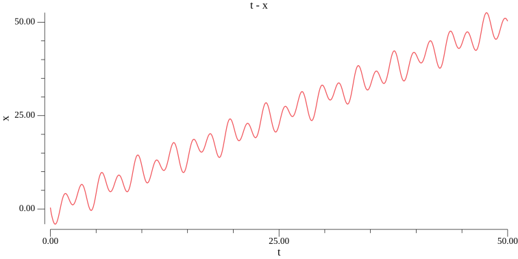
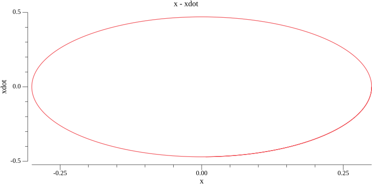

# doublependulum
The equation of motion and the phase diagram of a pendulum

I used this video to derive the [equation of motion](https://www.youtube.com/watch?v=tc2ah-KnDXw)

Positions:

``` math
\begin{aligned}
& x_1 = l_1\cdot sin(\theta_1)\\
& y_1 = -l_1\cdot cos(\theta_1)\\
& x_2 =  l_1\cdot sin(\theta_1) +  l_2\cdot sin(\theta_2)\\
& y_2 = -l_1\cdot cos(\theta_1) -l_2\cdot cos(\theta_2)
\end{aligned}
```

Velocities:

```math
\begin{aligned}
& \dot{x}_1 = \dot{\theta}_1 l_1 cos(\theta_1)\\
& \dot{y}_1 = \dot{\theta}_1 l_1 sin(\theta_1)\\
& \dot{x}_2 = \dot{\theta}_1 l_1 cos(\theta_1) + \dot{\theta}_2 l_2 cos(\theta_2)\\
& \dot{y}_2 = \dot{\theta}_1 l_1 sin(\theta_1) + \dot{\theta}_2 l_2 sin(\theta_2)
\end{aligned}
```

Potential energy:

```math
\begin{aligned}
V &= m_1gy_1+m_2gy_2 \\
  &= -(m_1+m_2) g l_1 cos(\theta_1)-m_2 g l_2 cos(\theta_2)
\end{aligned}
```

Kinetic energy:

```math
T = \frac{1}{2}m_1 l_1^2 \dot{\theta}_1 + \frac{1}{2}m_2(l_1^2\dot{\theta}_1^2 + l_2^2\dot{\theta}_2^2)
```

Equation of motion:



The phase diagram is pretty boring, it is just an ellipse:

